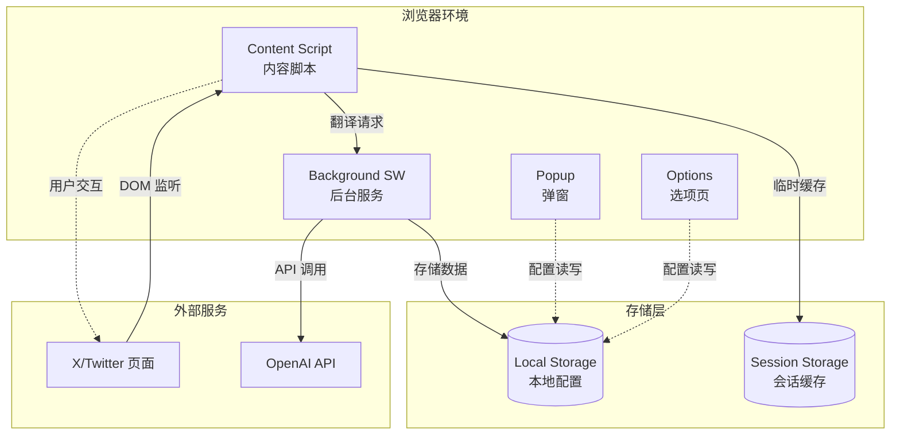
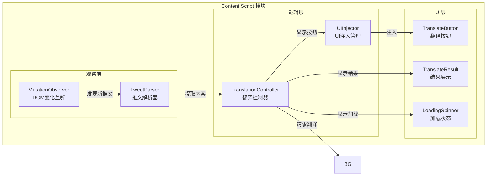
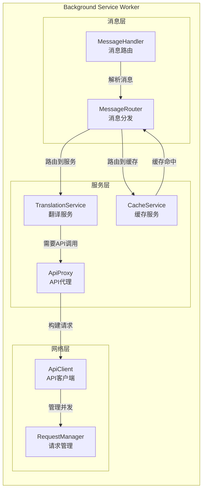
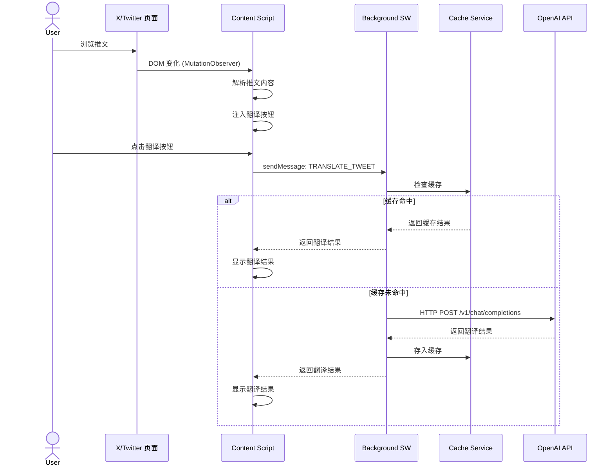
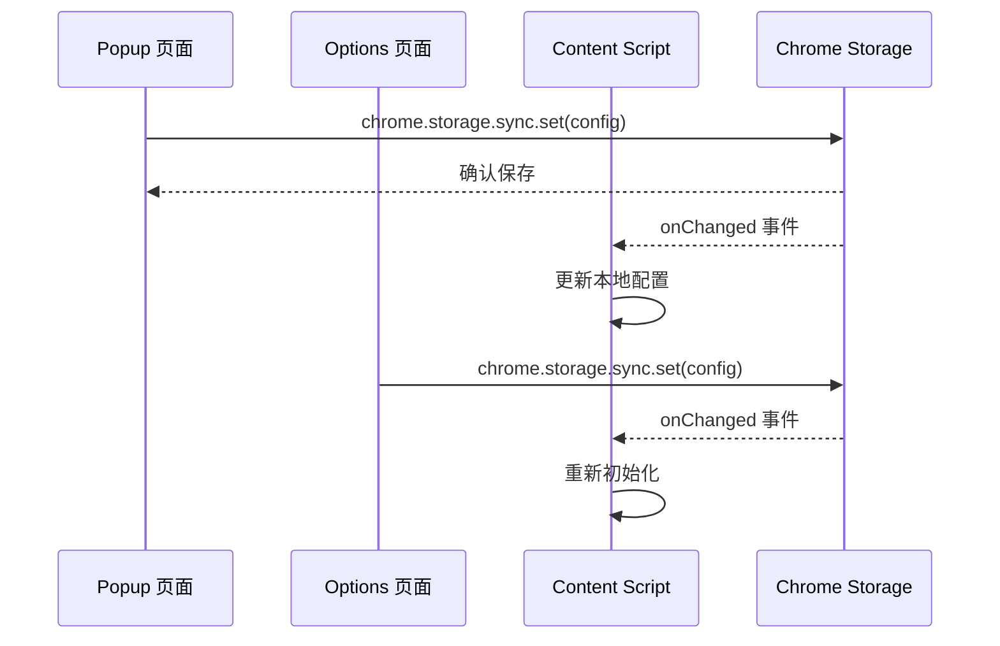
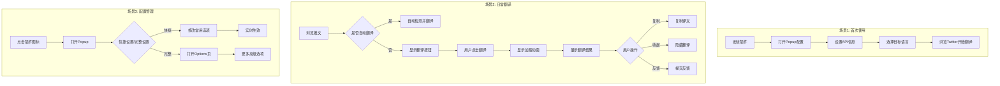
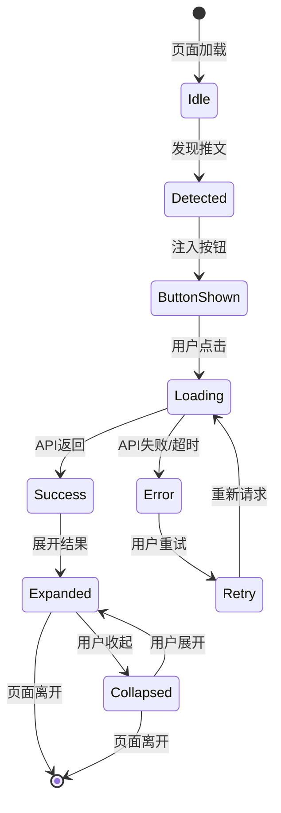

# AI翻译插件架构设计文档

## 1. 项目概述

### 1.1 产品定位
基于 Manifest V3 的浏览器扩展插件，专注于 X (Twitter) 推文的 AI 翻译，支持 OpenAI 兼容 API。

### 1.2 技术栈选型

| 领域 | 技术选择 | 说明 |
|------|----------|------|
| 框架 | Vanilla TypeScript | 轻量、无运行时依赖 |
| 构建工具 | Vite 5.x | 快速构建、HMR支持 |
| 浏览器 API | WebExtension API (Polyfill) | 跨浏览器兼容 |
| UI 组件 | 原生 Web Components | 避免样式冲突 |
| 状态管理 | 原生 Chrome Storage API | 持久化配置 |

### 1.3 浏览器兼容性

| 浏览器 | 最低版本 | 说明 |
|--------|----------|------|
| Chrome | 88+ | Manifest V3 支持 |
| Edge | 88+ | Chromium 内核 |
| Firefox | 109+ | Manifest V3 支持 |

---

## 2. 目录结构

```
ai-translator/
├── 📁 src/                          # 源代码目录
│   ├── 📁 background/               # Background Service Worker
│   │   ├── index.ts                 # SW 入口
│   │   ├── message-handler.ts       # 消息路由处理
│   │   └── api-proxy.ts             # API 请求代理
│   │
│   ├── 📁 content/                  # Content Scripts
│   │   ├── 📁 twitter/              # X/Twitter 特定逻辑
│   │   │   ├── index.ts             # Twitter 内容脚本入口
│   │   │   ├── tweet-observer.ts    # 推文 DOM 观察器
│   │   │   ├── tweet-parser.ts      # 推文内容解析
│   │   │   └── ui-injector.ts       # UI 注入管理
│   │   ├── 📁 components/           # Web Components
│   │   │   ├── translate-button.ts  # 翻译按钮组件
│   │   │   ├── translate-result.ts  # 翻译结果组件
│   │   │   └── loading-spinner.ts   # 加载动画组件
│   │   ├── 📁 styles/
│   │   │   └── shadow-styles.css    # Shadow DOM 样式
│   │   └── shared.ts                # Content Script 共享逻辑
│   │
│   ├── 📁 popup/                    # 弹出窗口
│   │   ├── index.html               # Popup HTML
│   │   ├── index.ts                 # Popup 入口
│   │   ├── settings-form.ts         # 设置表单逻辑
│   │   └── 📁 styles/
│   │       └── popup.css
│   │
│   ├── 📁 options/                  # 选项页面（完整设置）
│   │   ├── index.html
│   │   ├── index.ts
│   │   └── 📁 styles/
│   │
│   ├── 📁 shared/                   # 共享模块
│   │   ├── 📁 types/                # TypeScript 类型定义
│   │   │   ├── api.ts               # API 相关类型
│   │   │   ├── config.ts            # 配置类型
│   │   │   └── tweet.ts             # 推文相关类型
│   │   ├── 📁 constants/            # 常量定义
│   │   │   ├── selectors.ts         # DOM 选择器
│   │   │   └── messages.ts          # 消息类型常量
│   │   ├── 📁 utils/                # 工具函数
│   │   │   ├── api-client.ts        # API 客户端
│   │   │   ├── storage.ts           # Storage 封装
│   │   │   ├── dom-utils.ts         # DOM 操作工具
│   │   │   └── i18n.ts              # 国际化工具
│   │   └── 📁 services/             # 业务服务
│   │       ├── translation-service.ts # 翻译服务
│   │       └── cache-service.ts      # 翻译缓存服务
│   │
│   └── 📁 assets/                   # 静态资源
│       ├── icons/                   # 插件图标
│       └── images/                  # 其他图片
│
├── 📁 public/                       # 直接复制的静态文件
│   └── manifest.json                # 插件清单 (V3)
│
├── 📁 docs/                         # 文档
│   ├── architecture.md              # 本文件
│   ├── api-spec.md                  # API 接口规范
│   └── development.md               # 开发指南
│
├── 📁 scripts/                      # 构建脚本
│   ├── build.ts                     # 主构建脚本
│   └── pack.ts                      # 打包脚本
│
├── vite.config.ts                   # Vite 配置
├── tsconfig.json                    # TypeScript 配置
├── package.json
└── README.md
```

---

## 3. Manifest V3 配置

```json
{
  "manifest_version": 3,
  "name": "__MSG_extName__",
  "description": "__MSG_extDescription__",
  "version": "1.0.0",
  "default_locale": "zh_CN",
  
  "permissions": [
    "storage",
    "activeTab"
  ],
  
  "optional_permissions": [
    "scripting"
  ],
  
  "host_permissions": [
    "https://twitter.com/*",
    "https://x.com/*"
  ],
  
  "background": {
    "service_worker": "background/index.js",
    "type": "module"
  },
  
  "content_scripts": [
    {
      "matches": [
        "https://twitter.com/*",
        "https://x.com/*"
      ],
      "js": ["content/index.js"],
      "css": ["content/styles.css"],
      "run_at": "document_idle",
      "world": "ISOLATED"
    }
  ],
  
  "web_accessible_resources": [
    {
      "resources": ["assets/*", "content/web-accessible.js"],
      "matches": ["https://twitter.com/*", "https://x.com/*"]
    }
  ],
  
  "action": {
    "default_popup": "popup/index.html",
    "default_icon": {
      "16": "assets/icons/icon16.png",
      "32": "assets/icons/icon32.png",
      "48": "assets/icons/icon48.png",
      "128": "assets/icons/icon128.png"
    },
    "default_title": "__MSG_extName__"
  },
  
  "icons": {
    "16": "assets/icons/icon16.png",
    "32": "assets/icons/icon32.png",
    "48": "assets/icons/icon48.png",
    "128": "assets/icons/icon128.png"
  },
  
  "options_page": "options/index.html",
  
  "commands": {
    "toggle-translation": {
      "suggested_key": {
        "default": "Alt+T"
      },
      "description": "__MSG_cmdToggleTranslation__"
    }
  }
}
```

---

## 4. 核心模块设计

### 4.1 模块职责说明



### 4.2 Content Script 详细架构



### 4.3 Background Service Worker 架构



---

## 5. 数据流设计

### 5.1 翻译流程数据流



### 5.2 配置同步数据流



---

## 6. API 接口设计

### 6.1 OpenAI 兼容 API 调用规范

#### 6.1.1 请求格式

```typescript
// 翻译请求参数
interface TranslationRequest {
  // OpenAI 标准字段
  model: string;              // 模型名称，如 "gpt-4o-mini"
  messages: ChatMessage[];    // 对话消息
  temperature?: number;       // 默认 0.3（翻译任务需要确定性）
  max_tokens?: number;        // 最大 token 数
  stream?: boolean;           // 是否流式返回
  
  // 自定义字段（通过 extra_body 或单独处理）
  __source_lang?: string;     // 源语言（auto 为自动检测）
  __target_lang?: string;     // 目标语言
}

interface ChatMessage {
  role: 'system' | 'user' | 'assistant';
  content: string;
}

// 实际请求示例
const requestBody: TranslationRequest = {
  model: 'gpt-4o-mini',
  messages: [
    {
      role: 'system',
      content: 'You are a professional translator. Translate the following text accurately, preserving the tone and style. Only return the translation, no explanations.'
    },
    {
      role: 'user',
      content: `Translate from ${sourceLang} to ${targetLang}:\n\n${text}`
    }
  ],
  temperature: 0.3,
  max_tokens: 2000,
  stream: false
};
```

#### 6.1.2 响应格式

```typescript
// OpenAI 标准响应
interface TranslationResponse {
  id: string;
  object: 'chat.completion';
  created: number;
  model: string;
  choices: {
    index: number;
    message: {
      role: 'assistant';
      content: string;        // 翻译结果
    };
    finish_reason: string;
  }[];
  usage: {
    prompt_tokens: number;
    completion_tokens: number;
    total_tokens: number;
  };
}

// 错误响应
interface ApiError {
  error: {
    message: string;
    type: string;
    code: string;
  };
}
```

### 6.2 内部消息接口

```typescript
// Content Script <-> Background 消息类型
enum MessageType {
  // 翻译相关
  TRANSLATE_TWEET = 'TRANSLATE_TWEET',
  TRANSLATE_RESULT = 'TRANSLATE_RESULT',
  TRANSLATE_ERROR = 'TRANSLATE_ERROR',
  
  // 配置相关
  GET_CONFIG = 'GET_CONFIG',
  SET_CONFIG = 'SET_CONFIG',
  CONFIG_CHANGED = 'CONFIG_CHANGED',
  
  // 缓存相关
  CLEAR_CACHE = 'CLEAR_CACHE',
  GET_CACHE_STATS = 'GET_CACHE_STATS'
}

// 消息接口定义
interface TranslateTweetMessage {
  type: MessageType.TRANSLATE_TWEET;
  payload: {
    tweetId: string;
    text: string;
    sourceLang?: string;
    targetLang: string;
  };
}

interface TranslateResultMessage {
  type: MessageType.TRANSLATE_RESULT;
  payload: {
    tweetId: string;
    translatedText: string;
    detectedLang?: string;
    tokensUsed?: number;
  };
}
```

---

## 7. 用户交互流程

### 7.1 主要交互场景



### 7.2 UI 状态机



---

## 8. 关键技术细节

### 8.1 Twitter DOM 解析策略

```typescript
// 推文选择器（需要定期维护）
const SELECTORS = {
  // 推文容器
  TWEET_ARTICLE: 'article[data-testid="tweet"]',
  
  // 推文文本
  TWEET_TEXT: '[data-testid="tweetText"]',
  
  // 推文ID提取
  TWEET_LINK: 'a[href*="/status/"]',
  
  // 用户名称
  USER_NAME: '[data-testid="User-Name"]',
  
  // 时间戳
  TIMESTAMP: 'time',
  
  // 媒体内容
  MEDIA: '[data-testid="tweetPhoto"], [data-testid="videoPlayer"]'
} as const;

// 推文数据结构
interface ParsedTweet {
  id: string;
  text: string;
  author: {
    name: string;
    handle: string;
  };
  timestamp: string;
  hasMedia: boolean;
  element: HTMLElement;
}
```

### 8.2 Shadow DOM 隔离方案

```typescript
// 使用 Shadow DOM 避免样式污染
class TranslateButton extends HTMLElement {
  private shadow: ShadowRoot;
  
  constructor() {
    super();
    this.shadow = this.attachShadow({ mode: 'closed' });
    this.render();
  }
  
  private render() {
    this.shadow.innerHTML = `
      <style>
        :host {
          display: inline-flex;
          --btn-color: #1d9bf0;
        }
        .translate-btn {
          /* 完全隔离的样式 */
        }
      </style>
      <button class="translate-btn">
        <slot></slot>
      </button>
    `;
  }
}

customElements.define('ai-translate-button', TranslateButton);
```

### 8.3 缓存策略

```typescript
// 缓存键生成
function generateCacheKey(text: string, targetLang: string): string {
  const hash = simpleHash(text);
  return `trans:${targetLang}:${hash}`;
}

// 缓存项结构
interface CacheEntry {
  translatedText: string;
  detectedLang: string;
  timestamp: number;
  tokensUsed: number;
}

// 缓存管理配置
const CACHE_CONFIG = {
  // 最大缓存条目数
  MAX_ENTRIES: 1000,
  // 缓存过期时间 (7天)
  TTL: 7 * 24 * 60 * 60 * 1000,
  // 存储命名空间
  NAMESPACE: 'ai_translator_cache'
};
```

---

## 9. 安全与隐私

### 9.1 API 密钥存储
- 使用 `chrome.storage.local` 存储 API 密钥
- 不在代码中硬编码任何密钥
- 提供密钥清空功能

### 9.2 内容安全策略 (CSP)
```json
{
  "content_security_policy": {
    "extension_pages": "script-src 'self'; object-src 'self'; connect-src 'self' https:;"
  }
}
```

### 9.3 数据传输安全
- 强制 HTTPS API 端点
- API 密钥通过 Header 传输，不在 URL 中暴露

---

## 10. 扩展性设计

### 10.1 多平台支持扩展
```typescript
// 平台适配器接口
interface PlatformAdapter {
  name: string;
  match(url: string): boolean;
  selectors: PlatformSelectors;
  parseTweet(element: HTMLElement): ParsedTweet;
  injectUI(tweet: ParsedTweet): void;
}

// 未来可支持其他平台
const adapters: PlatformAdapter[] = [
  TwitterAdapter,
  // WeiboAdapter,
  // RedditAdapter,
  // ...
];
```

### 10.2 翻译服务扩展
```typescript
// 翻译服务提供者接口
interface TranslationProvider {
  name: string;
  translate(request: TranslationRequest): Promise<string>;
  detectLanguage(text: string): Promise<string>;
}

// 可接入多种服务
const providers: TranslationProvider[] = [
  OpenAIProvider,
  // ClaudeProvider,
  // DeepLProvider,
  // GoogleTranslateProvider,
];
```

---

## 11. 开发规范

### 11.1 代码组织原则
1. **单一职责**: 每个模块只负责一项功能
2. **依赖注入**: 服务通过构造函数注入
3. **接口优先**: 先定义接口，再实现具体逻辑
4. **错误边界**: 每个模块都有错误处理机制

### 11.2 命名规范
- 文件: `kebab-case.ts`
- 类: `PascalCase`
- 函数: `camelCase`
- 常量: `SCREAMING_SNAKE_CASE`
- 接口: `PascalCase` 前缀 `I` 可选

### 11.3 类型安全
```typescript
// 严格类型定义
// 使用 unknown 代替 any
// 显式返回类型
// 非空断言最小化使用
```

---

## 12. 性能优化策略

1. **虚拟滚动优化**: 只对可视区域内的推文注入UI
2. **防抖处理**: MutationObserver 回调防抖 100ms
3. **请求合并**: 短时间内多个翻译请求批量处理
4. **懒加载**: 翻译结果按需加载，不预加载
5. **缓存优先**: 本地缓存命中不调用API

---

## 13. 待办事项

- [ ] 实现核心模块骨架
- [ ] 完成 Twitter DOM 选择器配置
- [ ] 实现 OpenAI API 客户端
- [ ] 设计并实现 UI 组件
- [ ] 编写单元测试
- [ ] 跨浏览器兼容性测试
- [ ] 性能基准测试
